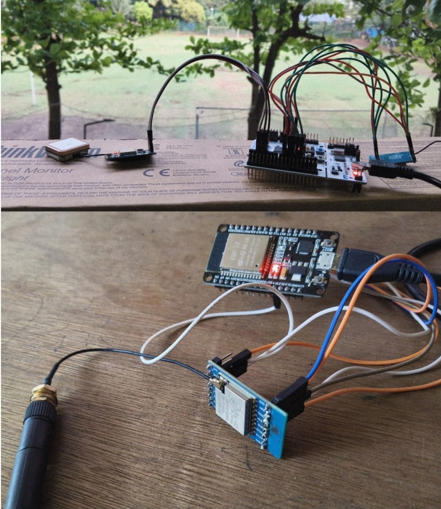
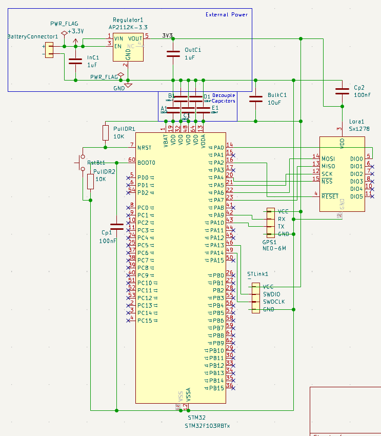
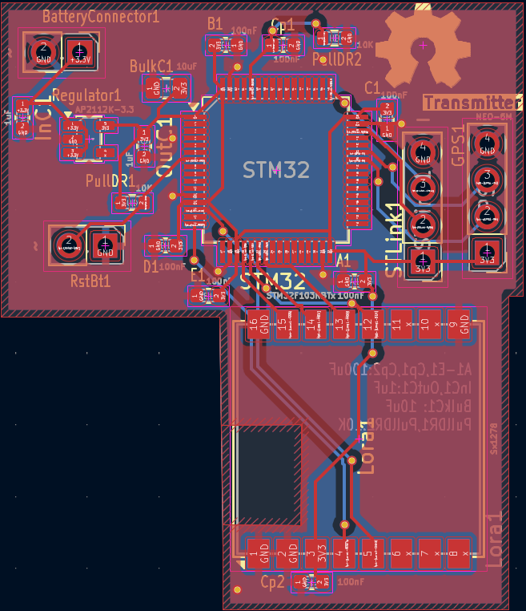
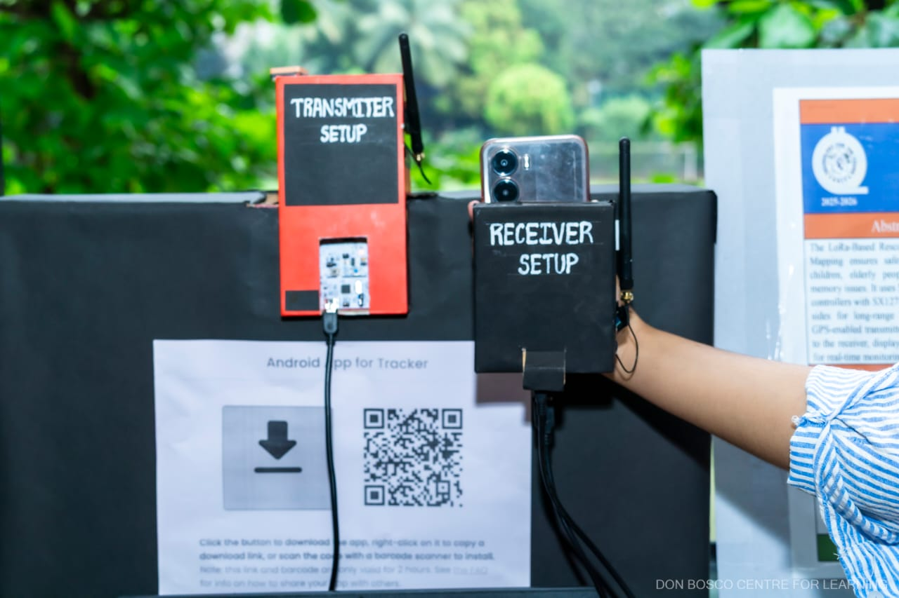
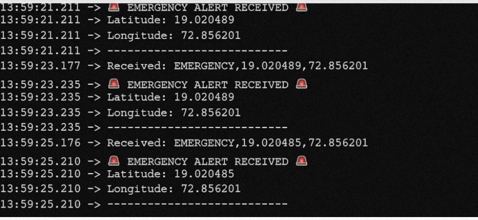

# LoRa GPS Tracking System (STM32 + ESP32)

## Introduction
This project implements a long-range wireless tracking system using LoRa communication. An STM32-based transmitter acquires real-time GPS coordinates and transmits them over LoRa, while an ESP32-based receiver processes and displays the received data. The system is designed for low-power, long-distance IoT tracking applications.

---

## Project Overview
The system consists of two nodes:
- **Transmitter (STM32 + GPS + LoRa)**: Captures and transmits location data.
- **Receiver (ESP32 + LoRa)**: Receives and decodes transmitted packets.

  

---

## Circuit Implementation and PCB Design
The circuit integrates STM32 with GPS (UART) and LoRa (SPI). A custom PCB was designed using KiCad to ensure compact and reliable hardware integration.

  

  

  

---

## Prototype and Output
The hardware prototype validates real-time communication between transmitter and receiver. The received GPS data is displayed via serial output.

  

  

---

## LoRa vs WiFi
| Feature | LoRa | WiFi |
|--------|------|------|
| Range | Long (km-level) | Short (meters) |
| Power Consumption | Low | High |
| Data Rate | Low | High |
| Application | IoT, tracking | Internet access |

LoRa is used due to its ability to transmit over long distances with minimal power, which is not feasible with WiFi.

---

## Components
- STM32 Microcontroller  
- ESP32  
- LoRa Module (SX1278)  
- GPS Module (NEO-6M)  
- Battery / Power Supply  
- Passive components and connectors  

---

## Basic Workflow
1. GPS module provides latitude and longitude via UART.  
2. STM32 reads and formats the data.  
3. LoRa module transmits the data packet.  
4. ESP32 receives the packet via LoRa.  
5. Data is decoded and displayed on serial monitor.  

---

## Technical Details

### Baud Rate
- GPS: 9600 bps  
- Serial communication: 115200 bps  

### Frequency of Operation
- LoRa operates at **433 MHz**

### STM32 Programming and Debugging
- Programming is done using **ST-Link** via SWD interface.  
- SWD pins used: SWCLK and SWDIO  
- Supports debugging features such as breakpoints and step execution  

### Communication Interfaces
- LoRa uses **SPI protocol**  
- GPS uses **UART protocol**  

---

## Results
- Successful long-range transmission of GPS coordinates  
- Stable communication between STM32 transmitter and ESP32 receiver  
- Demonstrates feasibility for real-time tracking systems  

---

## Tools Used
- KiCad (PCB design and schematic)  
- Arduino IDE (firmware development)  
- Embedded C (programming language)  
